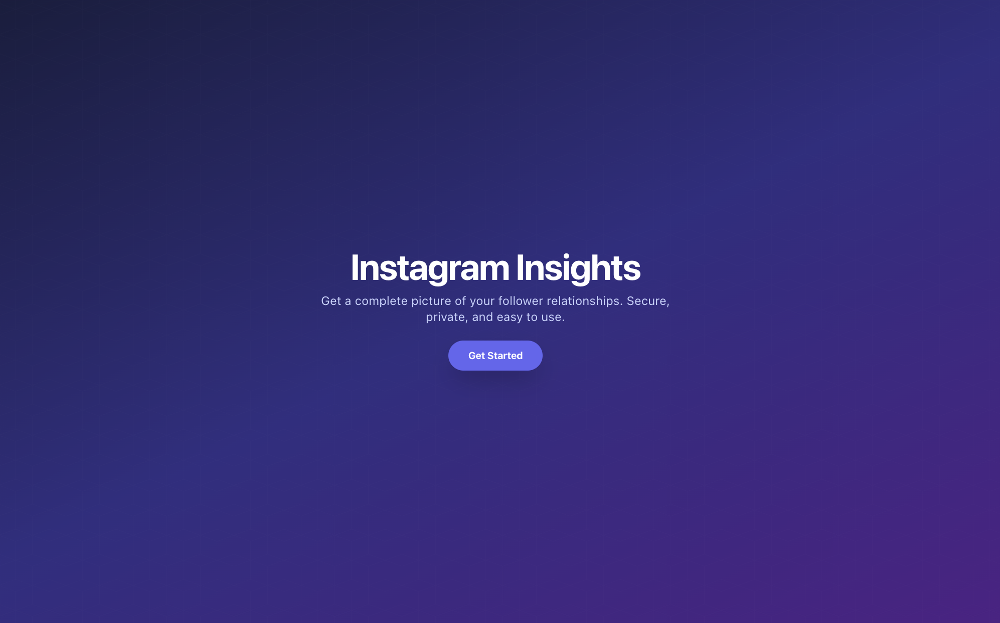
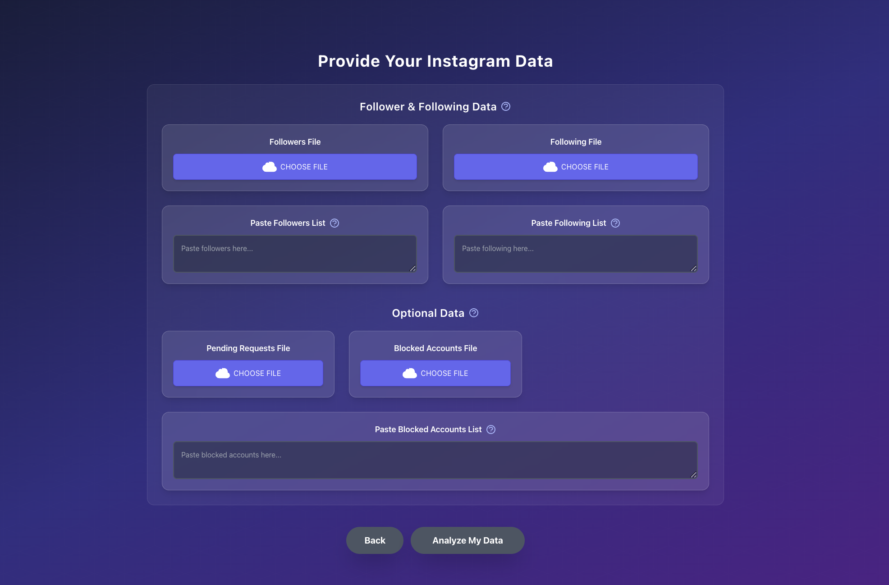

# Instagram Insights Checker

<table>
  <tr>
    <td></td>
    <td></td>
  </tr>
</table>

This project is a web application that allows you to analyze your Instagram follower data to gain insights into your account's relationships. You can upload your Instagram data files or paste the raw text to see who doesn't follow you back, whom you don't follow back, and your mutual connections. Additionally, it can track unfollowers and new followers between scans and provides AI-powered analysis of your followers.

---

## ✨ Features

- **Relationship Analysis**: Determines users who don't follow you back, users you don't follow back, and mutual followers.
- **Unfollower Tracking**: Identifies users who have unfollowed you since your last data analysis.
- **New Follower Tracking**: See who has followed you since your last scan.
- **Optional Data Analysis**: You can also upload data for pending follow requests and blocked accounts for a more complete picture.
- **AI-Powered Insights**: Get automated analysis and insights about your followers using AI.
- **Secure and Private**: The app uses Firebase for secure, anonymous authentication and data storage.

---

## 🚀 How to Use

To get your data from Instagram:

1.  Go to your Instagram Profile > **Settings and privacy** > **Accounts Center**.
2.  Select **Your information and permissions** > **Download your information**.
3.  Click **Request a download**, select your profile, and click **Next**.
4.  Choose **Select types of information**.
5.  Select **Followers and following**. Click **Next**.
6.  Set the format to **JSON**. Click **Submit request**.

Instagram will email you a link to download a ZIP file. Once you unzip it, look for `followers_1.json` and `following.json` inside the **followers_and_following** folder and upload them to the application. You can also paste the content of these files.

---

## 🛠️ Getting Started

This project was bootstrapped with [Create React App](https://github.com/facebook/create-react-app).

### Available Scripts

In the project directory, you can run:

**`npm start`**
_Runs the app in development mode._

**`npm test`**
_Launches the test runner._

**`npm run build`**
_Builds the app for production._

---

## ☁️ Deployment

The application is set up for continuous deployment using GitHub Actions and Firebase Hosting. Merges and pull requests to the `main` branch will trigger a build and deployment.

---

## 💻 Technologies Used

- **Frontend**: React, Tailwind CSS
- **Backend**: Firebase (Authentication, Firestore)
- **Deployment**: Firebase Hosting, GitHub Actions
